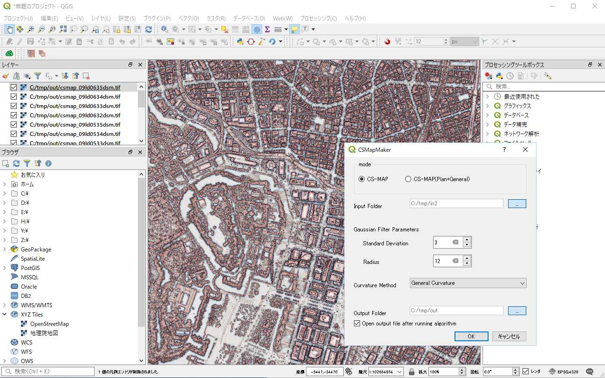

# CS立体図作成 QGISプラグイン
QGISで、長野県林業総合センター 戸田さまが開発したCS立体図を作成するためのプラグインです　　

QGISに読み込み済みのTif形式画像、もしくはTif形式画像が入ったディレクトリを指定することで一括処理を行えるバージョンは[こちら](https://github.com/waigania13/CSMapMaker/tree/master)から使用できます

このバージョンでは上記機能に加えて、LAS形式のデータからのバッチ処理機能が使用できます

## 前提条件
- 対象のQGISバージョンは3.4以降となります
- windowsにて検証済みです
- Lastoolsをインストールしてください http://www.cs.unc.edu/~isenburg/lastools/ 
- QGISにLASToolsプラグインをインストールしてください https://plugins.qgis.org/plugins/LAStools/

## CSMapMakerをインストール
- zipでダウンロード
- 解凍後のディレクトリを丸ごと、ユーザディレクトリ/AppData\Roaming\QGIS\QGIS3\profiles\default\python\pluginsにコピー
- QGISを起動してプラグインを有効にすると、メニューの「ラスタ」に「csmap」が入ります 

## 実行方法
- Batch Processing 　を選択してください
- Input Folderとして、ダウンロード済みのLAS形式データが入っているフォルダを指定します
- 実行すると、LAS形式データからCS立体図画像を作成します

# CSMapMaker plugin 
[Corresponding to QGIS v2.x is here](https://github.com/waigania13/CSMapMaker/tree/qgis2.x)

CS topographic map which is made from elevation, curvature and slope. CS topographic map represents valleys by blueish color and ridges by reddish color.

# Using The Plugin
## Single layer mode
* Load terrain raster layer.
* Run the CSMapMaker from icon. 
* Select DEM Layer and curveture method from menu.
* Adjust Gaussian Filter Parameters (if you need).
* Click [OK].

## Batch processing
* Run the batch processing from icon. 
* Select input folder. All tiff files in the input folder will be converted.
* Select output folder.
* Select DEM Layer and curveture method from menu.
* Adjust Gaussian Filter Parameters (if you need).
* Click [OK].

# License
Python modules are released under the GNU Public License (GPL) Version 2.

Copyright (c) 2017 Kosuke ASAHI

