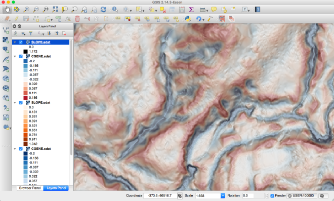
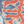
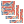

# CSMapMaker plugin 

CS topographic map which is made from elevation, curvature and slope. CS topographic map represents valleys by blueish color and ridges by reddish color.

# Using The Plugin
## Single layer mode
* Load terrain raster layer.
* Run the CSMapMaker from icon. 
* Select DEM Layer and curveture method from menu.
* Adjust Gaussian Filter Parameters (if you need).
* Click [OK].

## Batch processing
* Run the batch processing from icon. 
* Select input folder. All tiff files in the input folder will be converted.
* Select output folder.
* Select DEM Layer and curveture method from menu.
* Adjust Gaussian Filter Parameters (if you need).
* Click [OK].

# License
Python modules are released under the GNU Public License (GPL) Version 2.

Copyright (c) 2017 Kosuke ASAHI

# CS立体図作成 QGISプラグイン
QGISで、長野県林業総合センター 戸田さまが開発したCS立体図を作成するためのプラグインです　　

- zipでダウンロード
- 解凍後のディレクトリを丸ごと、ユーザディレクトリ/.qgis2/python/pluginsにコピー
- QGISを起動してプラグインを有効にすると、メニューの「ラスタ」に「csmap」が入ります 
- 実行して、ラスタレイヤを選択して「OK」をクリックすると一式計算します 

# 開発向け注意
qtデザイナでqgis custom widgetを使った場合に、エラーになる問題への対処  
- csmap_dialog_base.uiのcustomwidget headerの部分をqgis.guiに書き換え　　
- csmap_dialog_base.uiをpyuic4 -o csmap_dialog_base.py csmap_dialog_base.ui
 で変換　　
- 変換後のcsmap_dialog_base.pyにself.demlayer_box.setFilters(QgsMapLayerProxyModel.RasterLayer)を追記　　
- 変換後のcsmap_dialog_base.pyをfrom qgis.gui import QgsMapLayerComboBox, QgsSpinBox, QgsMapLayerProxyModelに変更